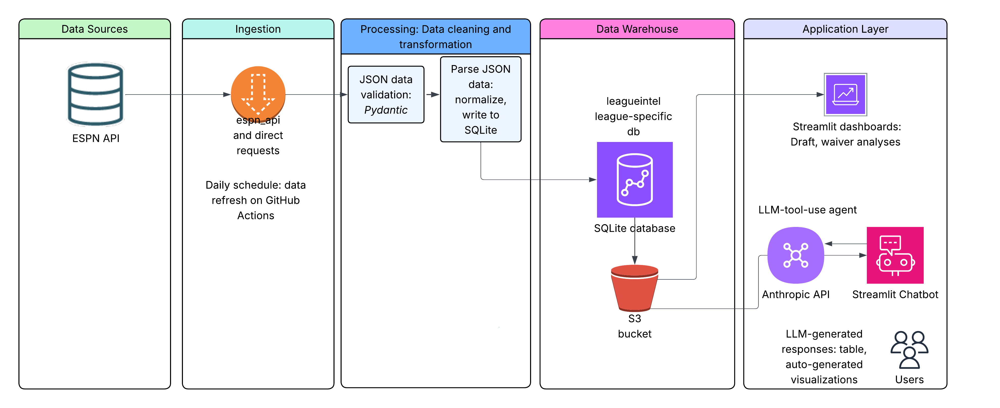

# leagueintel

An ESPN fantasy football analytics and competitive intelligence platform.
leagueintel ingests your league's full history and puts it behind an
LLM-powered chatbot that answers questions no other tool can. This is especially useful for private leagues and leagues with auction draft and/or free agent budget (FAAB) rules.

> "Who had the most regrettable drop of 2025?"
> "What was the most competitive waiver auction bid of all time?"
> "Who has had the best waiver instincts over all seasons?"

These questions are answerable in seconds because leagueintel persists
data ESPN deletes — including FAAB bid history, losing bids, and
weekly box scores going back to your league's founding.

---

## What it does

leagueintel is built for a single league. It knows your managers by
name, your league's scoring rules, your auction budget, and every
transaction since the first season with available data.

**Dashboard:**
- Draft ROI — bid amount vs points per game started, with position breakdown
- Best Waiver Pickup — position-normalized percentile score across all eligible adds
- Season Overview — standings, playoff bracket, last place (toilet bowl) history
- All-Time Head to Head — full win/loss matrix across every regular season game

**Chatbot:**
Ask anything in plain English. The chatbot routes simple questions to
_ad-hoc_ SQL and complex validated analytics (waiver scores, draft ROI)
to pre-built pandas pipelines, preventing the confident hallucinations
that plague naive text-to-SQL implementations. Under the hood, the semantic layer (views, well-documented schema descriptions) guides the LLM queries.

---

## How it works

### Self-hosted

leagueintel is self-hosted: you run your own instance
for your own league. Your data stays with you.

### Data ingestion

leagueintel ingests from ESPN's fantasy football API via
[`espn_api`](https://github.com/cwendt94/espn-api), a community-built
Python wrapper around ESPN's undocumented endpoints.

One piece of data ESPN deletes after each season: FAAB bid history,
including losing bids. leagueintel recovers this via an undocumented
`scoringPeriodId` parameter on ESPN's `mTransactions2` endpoint —
capturing the full bid history, including what every manager bid and
lost, before ESPN removes it.

### Architecture
- **Ingestion** — fetches from the ESPN API, validates with Pydantic, and normalizes into a SQLite database
- **Analytics** — pre-validated pandas functions for complex queries (waiver scores, draft ROI, standings)
- **LLM agent** — Anthropic API tool-use agent routes natural language questions to ad-hoc SQL or validated analytics
- **Frontend** — Streamlit dashboard and chatbot, password-gated and mobile-friendly

The database is stored in S3 — downloaded by Streamlit on cold start and refreshed weekly by GitHub Actions.

#### Design choices for persistent storage
The fantasy football database (leagueintel.db) is stored in S3 and 
downloaded to the Streamlit instance on cold start. SQLite was chosen 
as a lightweight embedded database appropriate for the scale — ~10MB, 
weekly updates, single writer — as opposed to heavier analytical engines 
like DuckDB or a managed Postgres instance. The Streamlit app's IAM policy is 
read-only, eliminating any risk of the app corrupting 
or overwriting the database — concurrency safety enforced at the 
infrastructure level rather than in code. S3 also has no read caps, 
making it the right choice for a database queried heavily by every user 
on every page load.

Token usage tracking requires persistent writes from the app after every 
question, which conflicts with the read-only S3 pattern. Turso (hosted 
SQLite) serves as a lightweight operational layer for this — persistent 
across cold starts, writable by the app, and completely independent of 
the weekly data refresh pipeline. Turso's free tier read caps are not a 
concern here since the usage table is queried only once per chatbot 
question, not on every page load.

### Tech stack 
- **Data & Storage** — Python 3.12, SQLite, S3, boto3
- **Ingestion** — `espn_api`, Pydantic, Click, Poetry
- **Analytics & Viz** — Plotly, Loguru
- **AI** — Anthropic API (Claude)
- **Frontend** — Streamlit
- **CI/CD** — GitHub Actions
- **LLM token usage tracking** - SQLite on Turso 

