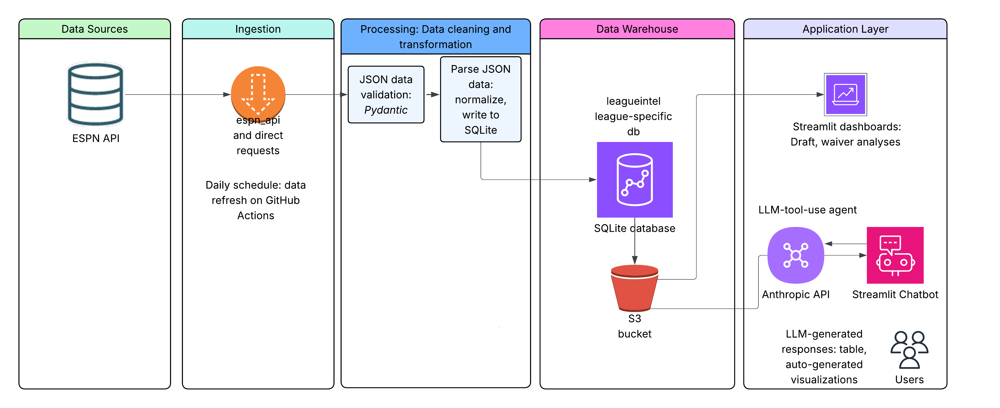

# 🏈 leagueintel

An ESPN fantasy football analytics and competitive intelligence
platform. leagueintel ingests your league's full history and puts
an LLM-powered chatbot in front of it, so you can ask open-ended
questions about your league instead of digging through spreadsheets
or ESPN's own limited UI (league data gets deleted after the season). Now you can back up your trash talk with
cold hard facts: draft value, waiver pickups, FAAB spending, and
head-to-head history, all in one place.

> "Who had the most regrettable drop of 2025?"
> 
> "What was the most competitive waiver auction bid of all time?"
> 
> "Who has had the best waiver instincts over all seasons?"
> 
> "Who was the biggest draft bust of all time in this league?"

These questions are answerable in seconds because leagueintel persists
data ESPN deletes — including FAAB bid history, losing bids, and
weekly box scores going back to your league's founding.

> **🔗 [Live App](https://leagueintel.streamlit.app/)**
> Private, password-protected — this is a real deployment used
> by my actual fantasy league, not a public demo. See screenshots
> below and the [full writeup](#) for a walkthrough of what it does.

---

## What it does

leagueintel is built for a single league. It knows your managers by
name, your league's scoring rules, your auction budget, and every
transaction since the first season with available data.

**Dashboard:**
- Draft ROI — bid amount vs points per game started, with position breakdown
- Best Waiver Pickup — position-normalized percentile score across all eligible adds
- Season Overview — standings, playoff bracket, last place (toilet bowl) history
- All-Time Head to Head — full win/loss matrix across every regular season game
- Podium — all-time top 3 finishers, consolation and last place finishers per season

**Chatbot:**
Ask anything in plain English. The chatbot routes simple questions to
_ad-hoc_ SQL and complex validated analytics (waiver scores, draft ROI)
to pre-built pandas pipelines, preventing the confident hallucinations
that plague naive text-to-SQL implementations. Under the hood, the semantic layer (views, well-documented schema descriptions) guides the LLM queries.

---

## How it works

### Self-hosted

leagueintel is self-hosted: you run your own instance
for your own league. Your data stays with you.

### Data ingestion

leagueintel ingests from ESPN's fantasy football API via
[`espn_api`](https://github.com/cwendt94/espn-api), a community-built
Python wrapper around ESPN's undocumented endpoints.

One piece of data ESPN deletes after each season: FAAB bid history,
including losing bids. leagueintel recovers this via an undocumented
`scoringPeriodId` parameter on ESPN's `mTransactions2` endpoint —
capturing the full bid history, including what every manager bid and
lost, before ESPN removes it.

### Data model

leagueintel's schema is built around three core concepts: **fantasy
teams**, **NFL players**, **transactions**, fantasy **box scores**. Teams own rosters
across seasons, players accrue weekly stats and move between teams via
transactions.

See [docs/data-model.md](docs/data-model.md) for the full ER diagram
and the reasoning behind key design decisions (e.g. why transactions
and their line items are separate tables, why teams are keyed by
season).

### Architecture
- **Ingestion** — fetches from the ESPN API, validates with Pydantic, and normalizes into a SQLite database
- **Analytics** — pre-validated pandas functions for complex queries (waiver scores, draft ROI, standings)
- **LLM agent** — Anthropic API tool-use agent routes natural language questions to ad-hoc SQL or validated analytics
- **Frontend** — Streamlit dashboard and chatbot, password-gated and mobile-friendly

The database is stored in S3 — downloaded by Streamlit on cold start and refreshed daily by GitHub Actions.

#### Design choices for persistent storage
The fantasy football database (leagueintel.db) is stored in S3 and 
downloaded to the Streamlit instance on cold start. SQLite was chosen 
as a lightweight embedded database appropriate for the scale, 
daily updates, single writer — as opposed to heavier analytical engines 
like DuckDB or a managed Postgres instance. The Streamlit app's IAM policy is 
read-only, eliminating any risk of the app corrupting 
or overwriting the database — concurrency safety enforced at the 
infrastructure level rather than in code. S3 also has no read caps, 
making it the right choice for a database queried heavily by every user 
on every page load.

Token usage tracking requires persistent writes from the app after every 
question, which conflicts with the read-only S3 pattern. Turso (hosted 
SQLite) serves as a lightweight operational layer for this — persistent 
across cold starts, writable by the app, and completely independent of 
the daily data refresh pipeline. Turso's free tier read caps are not a 
concern here since the usage table is queried only once per chatbot 
question, not on every page load.

### Tech stack 
- **Python 3.12**
- **Data & Storage**: SQLite, S3, boto3
- **Ingestion**: `espn_api`, Pydantic, Click
- **Analytics & Viz**: Plotly, Loguru
- **AI**: Anthropic API (Claude)
- **Frontend**: Streamlit
- **CI/CD**: GitHub Actions
- **LLM token usage tracking**: SQLite on Turso 
- **Packaging**: Poetry
---

### Taking anonymized screenshots

See [docs/anonymized_screenshots.md](docs/anonymized_screenshots.md) for
how to generate a one-time-anonymized copy of the database for
screenshots/demos.

