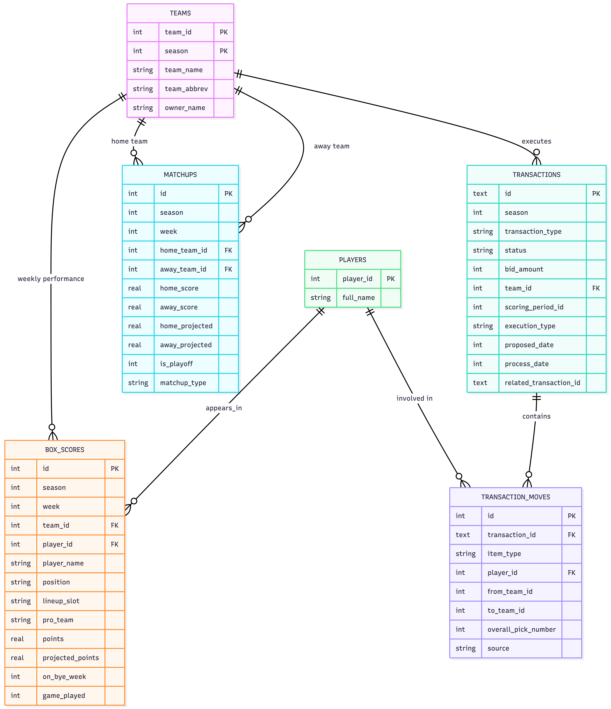

# Data model

## Tables

- **`teams`** — one row per fantasy team per season (`team_id` +
  `season`), with the team name, abbreviation, and owner as they were
  that season.
- **`players`** — a thin dimension table mapping `player_id` to an NFL
  player's name. No stats live here; those are always weekly
  (`box_scores`) or event-based (`transaction_moves`).
- **`matchups`** — one row per head-to-head fantasy matchup per week,
  pairing a home and away team (`home_team_id`/`away_team_id`) with
  their actual and projected scores, plus playoff/bracket metadata.
- **`box_scores`** — one row per player per team per week: points
  scored, projected points, position, and lineup slot (starter vs.
  bench/IR). The atomic fact table everything else rolls up from.
- **`transactions`** — one row per ESPN transaction event (add, drop,
  trade, waiver claim), with its status, FAAB bid amount, executing
  team, and processing dates.
- **`transaction_moves`** — one row per player or draft pick moved
  within a transaction, with `from_team_id`/`to_team_id`. Lets a single
  transaction fan out into multiple moves, e.g. a multi-player trade or
  a waiver claim that also drops a player.

Design decisions behind the schema, beyond what the ER diagram shows:

1. **`transactions` + `transaction_moves` split** — a single ESPN
   transaction (e.g. a trade) can move multiple players/picks between
   multiple teams. Splitting the *event* (`transactions`: who executed
   it, bid amount, status, dates) from its *line items*
   (`transaction_moves`: one row per player/pick moved,
   `from_team_id`→`to_team_id`) lets one trade or waiver claim fan out
   into N rows without denormalizing the event data N times. This is
   also what makes FAAB losing-bid recovery and multi-team trades
   representable at all.

2. **Composite PK on `teams (team_id, season)`** — ESPN reuses
   `team_id` across seasons, but a team's name/owner can change year to
   year (rebrands, ownership handoff). Keying by season means
   historical box scores/matchups always join to the name as it was
   that season, not today's name.

3. **`box_scores` as the atomic fact table, `matchups` as the
   aggregate** — points are stored per-player-per-week (with
   `lineup_slot`, so bench/IR points are distinguishable from starters
   — ties to the `NON_STARTING_SLOTS` constant), while `matchups`
   stores the team-level roll-up ESPN itself reports. Keeping both
   means analytics can recompute "what if" lineups from `box_scores`
   without trusting ESPN's aggregate, while still having the official
   scores for display.

4. **`players` is a thin dimension table** — just id/name, no stats —
   because stats are inherently weekly/contextual (`box_scores`) or
   event-based (`transaction_moves`), so there's no single "current"
   player row that would make sense to store stats on.

5. **`matchups.home_team_id`/`away_team_id` both FK to
   `teams.team_id`** — a matchup is inherently two-sided, but `teams`
   only has one row per team per season, so the pairing lives entirely
   in `matchups` via two FK columns rather than a separate join table.
   `box_scores` then joins back to `teams` through a single `team_id`
   per row — so for any given `matchups` row, the two "sides" are
   reconstructed by pulling the `box_scores` rows matching
   `season`+`week`+`team_id = home_team_id` and again for
   `away_team_id`. That's why `box_scores` is a paired entity relative
   to `matchups`: each row is one team's half of a matchup, and the
   pairing key is implicit (same season/week, opposite team_id in the
   same matchup row) rather than a stored relationship.
